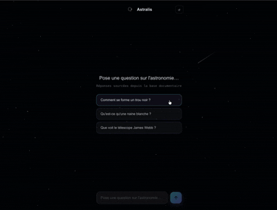

# Astralis ✦ — Assistant Astronomie RAG

Astralis est un assistant conversationnel spécialisé en astronomie, propulsé par une architecture RAG (Retrieval-Augmented Generation). Contrairement à un simple chatbot, Astralis ne répond pas depuis sa mémoire : il recherche d'abord les passages les plus pertinents dans une base documentaire de plus de 60 sources (Wikipedia FR, OpenStax Astronomy, articles scientifiques), puis génère une réponse précise et sourcée en s'appuyant sur ce contexte. Le résultat : des réponses détaillées, enthousiasmes et ancrées dans des documents vérifiables — avec les liens sources affichés en fin de réponse.

## Démo

<p align="center">
  
  <br />
  <a href="https://astralis.vercel.app">🔭 Voir la démo live</a>
</p>

🔭 **[Voir la démo live](https://astralis-taupe.vercel.app)**

---

## Stack technique

| Technologie | Rôle | Pourquoi ce choix |
|---|---|---|
| **Next.js 14** | Framework fullstack | App Router + API Routes dans un seul projet |
| **TypeScript** | Langage | Typage strict, indispensable sur un projet IA |
| **Supabase + pgvector** | Base vectorielle | PostgreSQL natif, pas de service externe supplémentaire |
| **OpenAI text-embedding-3-small** | Embeddings | Meilleur rapport qualité/coût, multilingue |
| **OpenAI gpt-4o-mini** | LLM | Rapide, peu coûteux, qualité suffisante pour la vulgarisation |
| **Vercel** | Déploiement | Intégration GitHub native, edge functions, zéro config Next.js |
| **unpdf** | Extraction PDF | Plus fiable que pdf-parse sur les gros documents |

---

## Comment ça marche

Le pipeline RAG se déroule en 4 étapes à chaque question :

**1. Embedding de la question**
La question de l'utilisateur est transformée en vecteur de 1536 dimensions via l'API OpenAI (`text-embedding-3-small`).

**2. Recherche vectorielle**
Ce vecteur est comparé par similarité cosinus aux ~80 000 chunks stockés dans Supabase/pgvector via la fonction `match_documents`. Les 6 chunks les plus proches sémantiquement sont récupérés (threshold : 0.3).

**3. Construction du contexte**
Les chunks pertinents sont injectés dans le prompt système avec leurs URLs sources. Le modèle dispose ainsi du contexte documentaire pour ancrer sa réponse.

**4. Génération streamée**
`gpt-4o-mini` génère la réponse en streaming via l'AI SDK de Vercel. Les URLs sources sont envoyées en préfixe du stream et affichées en fin de réponse sous forme de liens cliquables.

### Schéma du pipelaine
```
Question utilisateur
        │
        ▼
[Embedding OpenAI]
        │
        ▼
[Recherche pgvector] ──► 6 chunks pertinents
        │
        ▼
[Prompt système + contexte]
        │
        ▼
[GPT-4o-mini streaming]
        │
        ▼
Réponse + sources
```
---

## Installation locale

### Prérequis
- Node.js 18+
- Un projet Supabase avec pgvector activé
- Une clé API OpenAI

### Variables d'environnement

Crée un fichier `.env.local` à la racine :

```env
OPENAI_API_KEY=sk-...
SUPABASE_URL=https://xxx.supabase.co
SUPABASE_SERVICE_KEY=eyJ...
```

### Lancer le projet

```bash
git clone https://github.com/Paul-Cocaud-Pro/rag-assistant
cd rag-assistant
npm install
npm run dev
```

### Ingestion des documents

Place tes PDFs dans le dossier `/documents` puis lance :

```bash
npx ts-node scripts/ingest.ts
```

L'ingestion traite chaque PDF séparément, génère les embeddings par batch de 10 et les stocke dans Supabase avec leur URL source.

---

## Structure du projet
```
├── documents/          # PDFs sources (non versionnés)

├── scripts/

│   └── ingest.ts       # Pipeline d'ingestion

├── src/

│   └── app/

│       ├── api/chat/

│       │   └── route.ts        # API RAG + streaming

│       ├── page.tsx            # Interface chat

│       ├── chat.module.css     # Styles

│       └── StarryBackground.tsx # Canvas étoilé animé

└── public/

└── logo.png
```
---

## Auteur

**Paul Cocaud** — Ingénieur Full-Stack & AI  
[LinkedIn](https://linkedin.com/in/paul-cocaud-340b03141) · [GitHub](https://github.com/Paul-Cocaud-Pro)